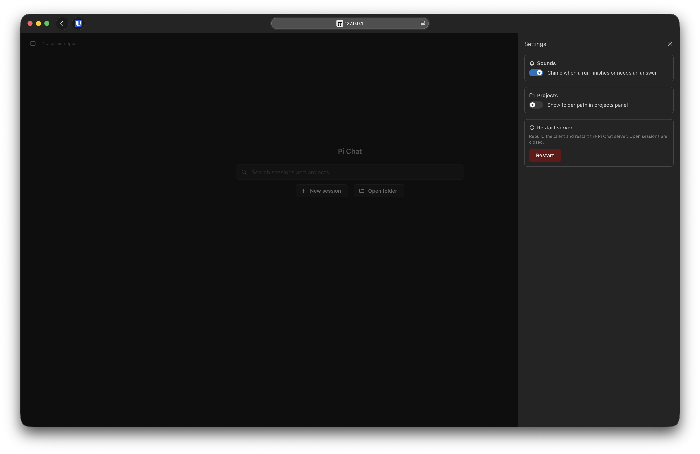
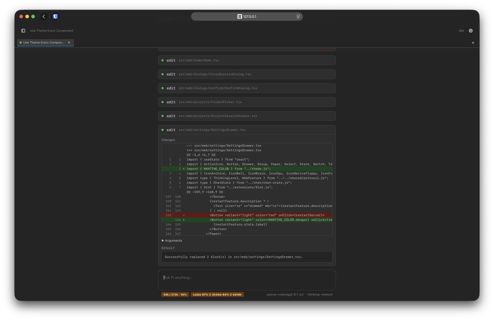
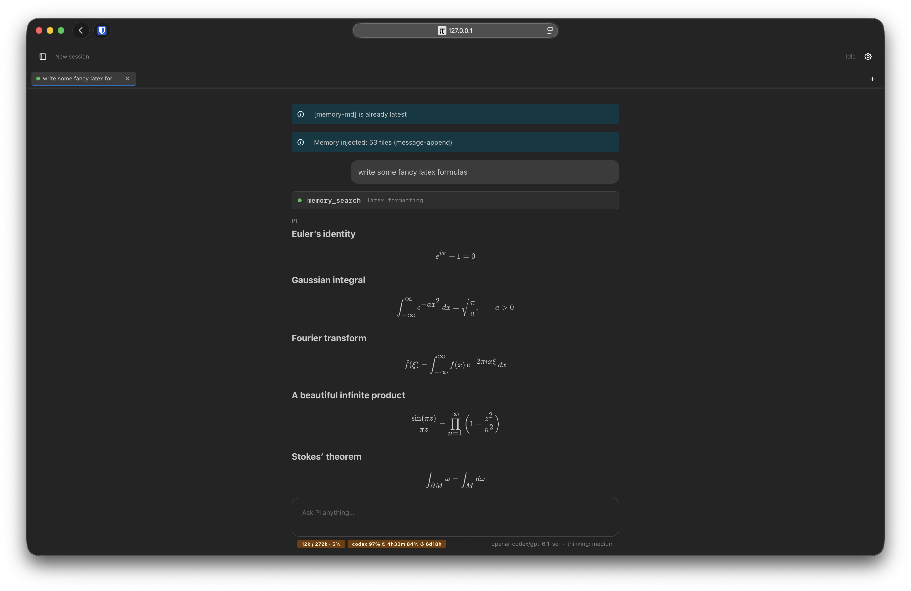
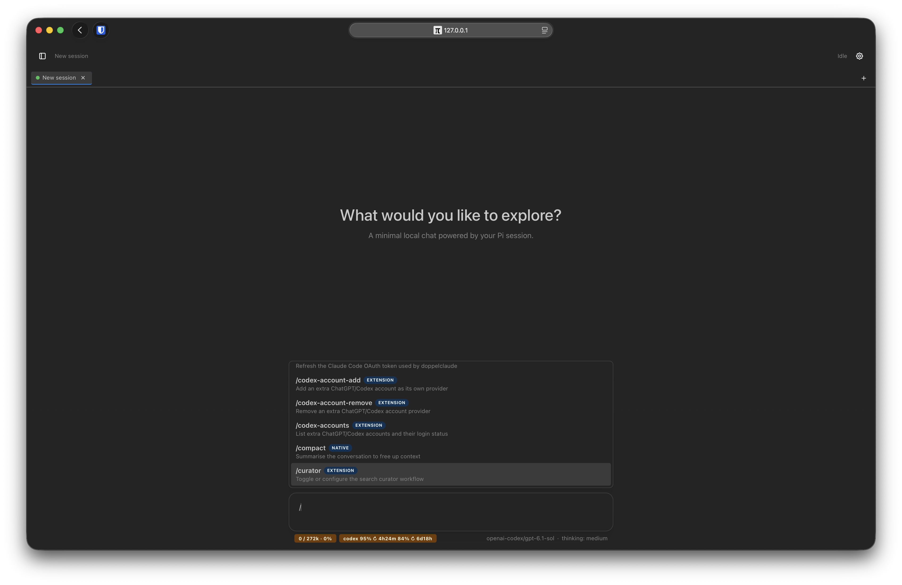
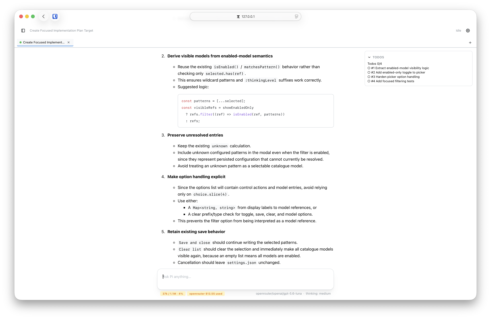

# Pi Chat

- A local browser chat for [Pi](https://github.com/earendil-works/pi)
- running on the real Pi runtime: your credentials, extensions, tools, and persistent session files.







## Features

- streaming assistant text, tool cards, Markdown + KaTeX
- multiple tabs over persistent Pi sessions, with project/session browsing
- server folder picker to start sessions in folders without previous Pi history
- slash commands with Pi extension argument completion, a command palette, and quick-open
- extension UI support: `notify`, dialogs, `setWidget` panels, `setStatus` footer labels, and experimental web extension slots/actions/hooks

## Install

```bash
pi install git:github.com/ManuelSelch/pi-chat
```

That clones the repo into `~/.pi/agent/git/pi-chat` and registers the extension,
which adds three commands to any Pi session:
- `/pi-chat-start`: start pi-chat server
- `/pi-chat-stop`: stop pi-chat server
- `/pi-chat`: show status

## Keyboard shortcuts

| Shortcut | Effect |
| --- | --- |
| `⌘⇧O` / `Ctrl+Shift+O` | Quick-open: type a session or project name |
| `⌘O` / `Ctrl+O` | Same, in browsers that hand the key over (not Safari) |
| `⌘K` / `Ctrl+K` | Session actions (new, rename, delete, close tab) plus every Pi slash command |
| `Esc` | Stop the current run; an open dialog or menu closes first |
| `Ctrl+C` | Clear the composer, unless text is selected so Copy still works |


## Command argument completion

After `/command `, Pi Chat shows suggestions from the extension's existing
`getArgumentCompletions(prefix)` callback, including async providers. Use arrows
to navigate, Enter/Tab or the mouse to insert, and Escape to dismiss. Selecting
an argument does not execute the command; press Enter again to submit.

The prefix is the full first-line argument text before the caret. Selecting a
suggestion replaces that prefix with its `value`, preserving text after the
caret. Pi owns filtering and ordering. No Pi Chat-specific extension API is
needed. Native command dialogs, filesystem completion, and general
`addAutocompleteProvider()` hooks are not part of this support.

## Architecture

See the [high-level web and server architecture](docs/architecture.md) for components,
data flow, and ownership boundaries.

## Server organization

`src/server/index.ts` remains the process entry point. Server code is grouped by ownership:

- `bootstrap/`: HTTP server composition and process restart
- `application/`: chat coordination and open-session registry
- `transport/`: WebSocket connections and protocol handling
- `runtime/contracts.ts`: runtime adapter, factory, event and snapshot contracts; `runtime/pi/` contains the Pi adapter, browser UI bridge and SDK cache workaround
- `projects/`: session catalogue and directory browsing
- `extensions/`: web extension registry; `extensions/ui/` contains prompt, widget and status registries

The test fake lives in `test/support/fake-runtime-adapter.ts`, separate from production contracts. Runtime implementation extraction is deferred.
The old `src/server/extension-registry.ts` import remains a deprecated compatibility re-export of `extensions/extension-registry.ts`.

## Frontend organization

`src/web/` has six responsibility owners:

- `app/`: startup, composition, state/transport, shell, overlays, and global keyboard routing.
- `chat/`: transcript, Markdown, tool results, and composer.
- `sessions/`: Home, tabs, project/folder browsing, quick-open, and session dialogs.
- `settings/`: settings controls and persistent browser preferences.
- `extensions/`: runtime slots, prompts, widgets, and footer metadata.
- `ui/`: application-independent primitives, theme, and generic confirmation.

Application services depend on shared types and other services, not presentation.
Feature containers may consume app context/state and overlay coordination; views
stay prop-driven. Only app composition imports the shell and `AppOverlays`.
Shared UI has no app/feature dependencies; extension views do not import chat or
shell components. Use direct file imports, including type-only imports, without
barrels or compatibility shims.

`AppOverlays` assembles overlays in their existing order; providers remain in
`App`. Settings stays mounted while closed to preserve chime playback. App owns
Home/transcript selection, composer height, and widget docking.

See [the grouping plan and verification record](docs/web-organization/REQUIREMENTS.md)
for detailed boundaries and migration history.

## Environment variables

| Variable | Meaning |
| --- | --- |
| `PI_CHAT_PORT` | Port to listen on (default `8788`) |
| `PI_CHAT_CWD` | Pi project directory for new sessions |
| `PI_CHAT_MODEL` | Model override for this server |
| `PI_CHAT_HOME` | Path to this checkout, when the extension is not inside it |