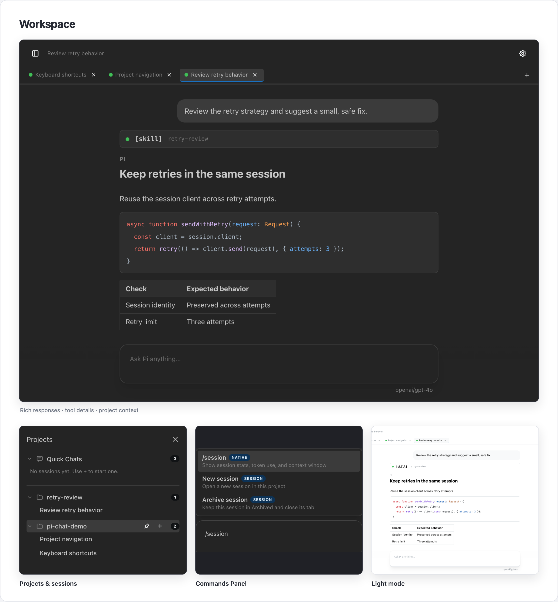

# Pi Chat

A local browser workspace for [Pi](https://github.com/earendil-works/pi), using your existing credentials, extensions, tools, and persistent sessions.

[](./docs/images/showcase/pi-chat-showcase.png)

## Features

- Streaming chat with Markdown, LaTeX, and light/dark themes.
- Tool cards with highlighted code, edit diffs, and file previews.
- Persistent session tabs, project browsing, and a Quick Switcher.
- Native steering to guide Pi during a run.
- Pi commands, skills, argument completion, and bash execution.
- Extension dialogs, ANSI-styled plain-text widgets, status labels, and experimental web UI hooks.

## Get started

Install the Pi package:

```sh
pi install git:github.com/ManuelSelch/pi-chat
```

Run `/pi-chat start`, then open [localhost:8788](http://localhost:8788).
Use `/pi-chat stop` to stop the server, `/pi-chat restart` to rebuild and restart,
or `/pi-chat` to check its status.

## Documentation

- [Usage](docs/usage.md): shortcuts, sessions, steering, commands, and file previews.
- [Configuration](docs/configuration.md): server settings, environment variables, and troubleshooting.
- [Development](docs/development.md): local setup, testing, source organization, and screenshot capture.
- [Architecture](docs/architecture.md): components and data flow.
- [Extension API](docs/extension-api.md): experimental web UI extension integration.
