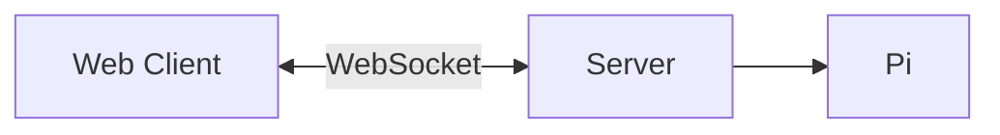
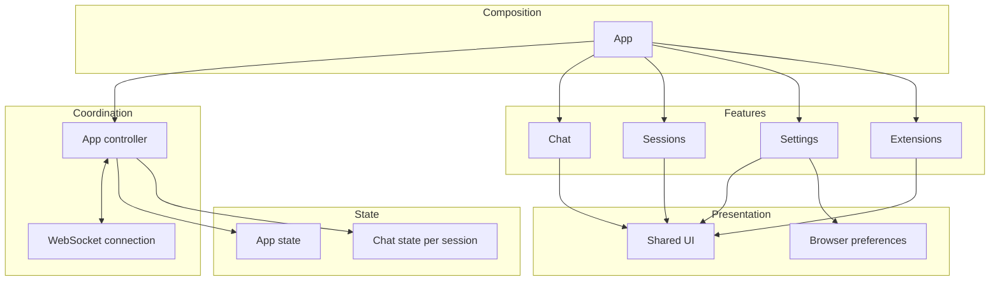

# High-level architecture

Pi Chat is a local React web client backed by a Node.js server running Pi in-process.
The server owns agent sessions; the browser displays their state and sends commands.

## Web

- **`src/web/app/`** composes the application, shell, overlays and keyboard routing.
  `use-pi-chat.ts` owns the socket and reconnect lifecycle; `state/` projects server
  snapshots and streaming events into browser state.
- **`chat/`, `sessions/`, `settings/`, `extensions/`** own feature UI: transcript
  and composer, tabs and folder/session browsing, settings, and extension UI.
- **`ui/`** contains application-independent primitives and theme.
- Containers connect app state/actions to prop-driven views. Browser-only state
  includes drafts, overlays and preferences; agent execution stays on the server.

## Server

- **`src/server/index.ts` and `bootstrap/`** start and compose the process.
  Express serves `/health` and the built web app; the same HTTP server hosts `/ws`.
- **`transport/`** validates protocol messages, routes browser commands, and sends
  session-scoped snapshots and sequenced events. By default, one browser connection
  controls the server; a new connection replaces the previous controller.
- **`application/`** coordinates commands and session lifecycle. `SessionRegistry`
  owns multiple open runtime adapters, allowing separate sessions to keep running
  while the browser switches tabs.
- **`runtime/contracts.ts` and `runtime/pi/`** isolate runtime execution behind
  `RuntimeAdapter`. The Pi implementation hosts the SDK and translates its messages,
  tool events and extension UI into application data. Tests can supply a fake adapter.
- **`projects/`** discovers persistent sessions and browses server-side directories.
- **`extensions/`** manages web extension actions/hooks/slots and UI registries.

## Data flow and boundaries

1. The browser sends a command such as prompt, abort, open session or run action.
2. The transport validates it using **`src/shared/protocol.ts`** and calls the
   application service, which targets the appropriate runtime adapter or service.
3. Runtime events stream back through the transport; browser reducers update the UI.
   Snapshots rebuild authoritative session state on connection and refresh.

Shared protocol types and schemas are the web/server boundary. Pi credentials,
model calls, tool execution and session persistence belong on the server—not in
React. Browser-owned state must survive snapshot replacement explicitly.

The standard server binds to loopback and is intended for trusted local use;
folder selection and tools use the server's filesystem permissions. In development,
Vite serves the web client and proxies server requests; production serves the build
from the Node.js server.

For detailed module boundaries, see the [web organization](web-organization/REQUIREMENTS.md),
[server organization](server-organization/REQUIREMENTS.md), and
[extension API](extension-api.md) documents.
