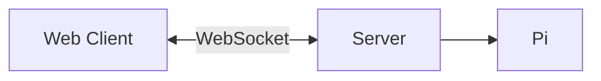
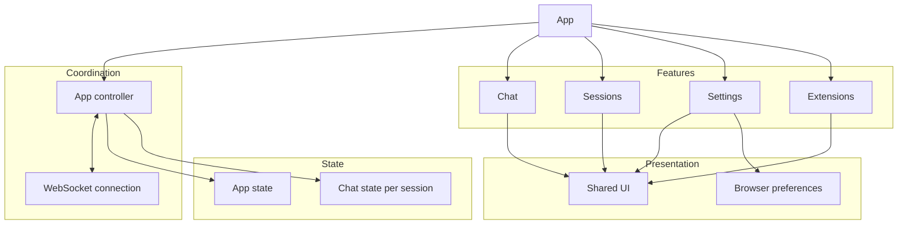
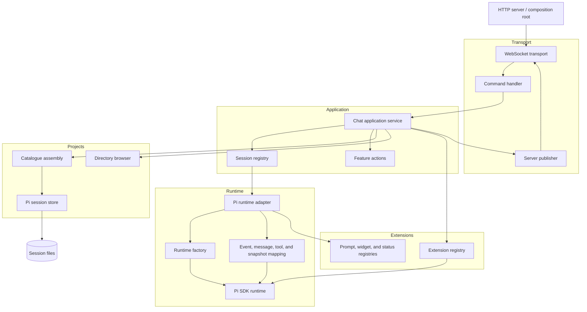

# High-level architecture

Pi Chat is a local web client backed by a server running Pi.
The server owns agent sessions; the client displays state and sends commands.

## Web

- `App` manages the WebSocket connection and application state.
- Chat, Sessions, Settings, and Extensions provide the main web features.
- Shared UI and browser preferences support the features.

## Server

- The HTTP server serves the client and hosts the WebSocket connection.
- Application services manage sessions, projects, actions, and extensions.
- The runtime adapter connects the application to Pi and session files.
